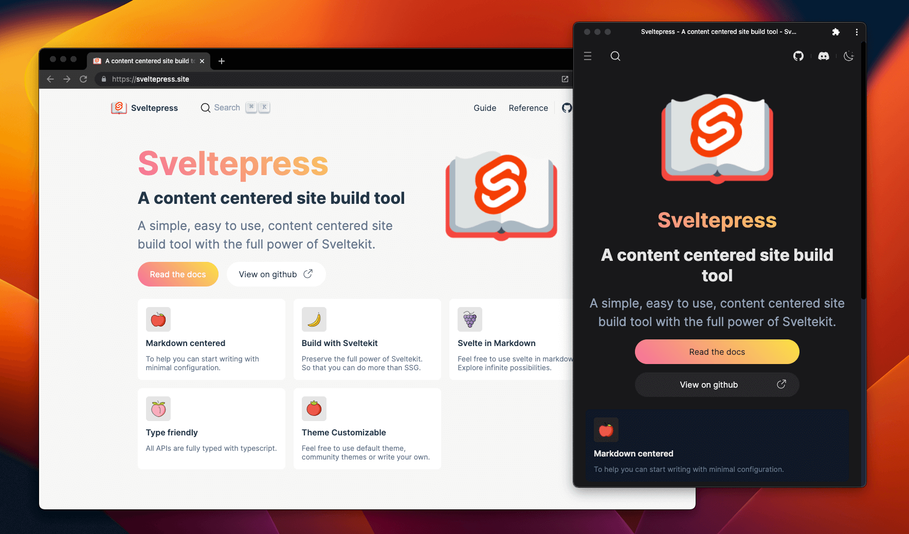
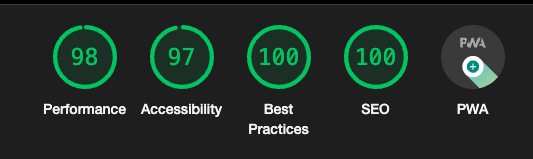

<h1 align="center">
   
 
   
  Sveltepress
   
   
</h1>

A content centered site build tool

  

  

## :pizza: Introduction

Inspired by [Vitepress](https://vitepress.vuejs.org/)
Build with [SvelteKit](https://kit.svelte.dev/)

## :bookmark_tabs: Online docs and demos

[Sveltepress](https://sveltepress.site/)

## :pray: Contributing

First of all, all kinds of contributions are welcomed!

For contributing details, see [Contributing](./CONTRIBUTING.md)

## :heart: Thanks

This project can not be done without these projects

* [Vitepress](https://vitepress.vuejs.org/)
* [SvelteKit](https://kit.svelte.dev/)
* [Svelte](https://svelte.dev/)
* [Vitest](https://vitest.dev/)
* [Vite](https://vitejs.dev/)
* [Unocss](https://github.com/unocss/unocss)
* [Shiki](https://github.com/shikijs/shiki)
* [Remark](https://github.com/remarkjs/remark)
* [Rehype](https://github.com/rehypejs/rehype)
* [Vite PWA](https://github.com/vite-pwa/docs)

## Who's using

## LICENSE

[MIT](./LICENSE)
