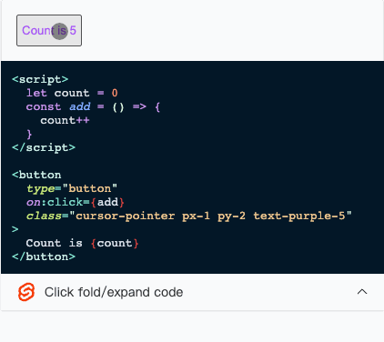

# Sveltepress 

Inspired by [Vitepress](https://vitepress.vuejs.org/). 
But build with [SvelteKit](https://kit.svelte.dev/), [Mdsvex](https://mdsvex.com/), [UNOCSS](https://github.com/unocss/unocss)

## Quick start

You can manually follow these steps to construct your own project

- Create a sveltekit project by using `npm create svelte@latest my-app`. Or you can follow the [Creating a project - SvelteKit](https://kit.svelte.dev/docs/creating-a-project)
- `npm install @svelte-press/svelte-preprocessor @svelte-press/vite`
- Add sveltepress vite plugin in your vite.config.(js|ts)
```js
// vite.config.(js|ts)
import { defineConfig } from 'vite'
import Sveltepress from '@svelte-press/vite'

const config = defineConfig({
  plugins: [
    Sveltepress(),
  ],
})

export default config
```
- Add sveltepress preprocessor in your svelte.config.js
```js
// svelte.config.js
import adapter from '@sveltejs/adapter-static'
import { vitePreprocessor } from '@sveltejs/kit/vite'
import sveltepressPreprocessor from '@svelte-press/svelte-preprocessor'

/**
 * @type {import('@sveltejs/kit').Config}
 */
const config = {
  extensions: ['.svelte', '.md'], // Add support for markdown files
  preprocess: [vitePreprocessor(), sveltepressPreprocessor({})],
  kit: {
    adapter: adapter(),
  },
}
export default config
```
- Import `'virtual:sveltepress'` module in your src/routes/+layout.(md|svelte). 
Your layout file may look like this:
```html
<!-- src/routes/+layout.(md|svelte) -->
<script>
  import 'virtual:sveltepress'
  // your other codes
</script>
<!-- Some layout content -->
```
Notice that you will no longer need to `import 'uno.css'`, the `virtual:sveltepress` would handle that
- Now you can start to write markdowns.

## Markdown Features

### Code Highlight

````md
```js
function name(params) {

  return 'foo'
}
```
````

### Svelte in Markdown

* `.svelte` and `.md` can be used as pages. For example, you can use `+page.(svelte|md)` as pages and `+layout.(md|svelte)` as layouts
* `.md` files can use the features provided by [Mdsvex](https://mdsvex.com/)

### Live Code

Code Blocks with svelte lang and `live` attribute would render in page and show the __expandable source code__ below the render dom

For example write something like this in your markdown

````md
```svelte live
<script>
  let count = 0
  const add = () => {
    count++
  }
</script>

<button 
  type="button" 
  on:click={add} 
  class="cursor-pointer px-1 py-2 text-orange-5"
>
  Count is {count}
</button>
```
````

Would render like this



### Admonition Block

```md
:::[tip|info|caution|warning|important|note] Title
Some admonition content
:::
```

## Themes

### Default Theme

> TODO: Add default theme1

### Blog Theme

> TODO: Add blog theme

## Online docs and demos

> TODO: Add online docs and demos

## LICENSE

MIT
