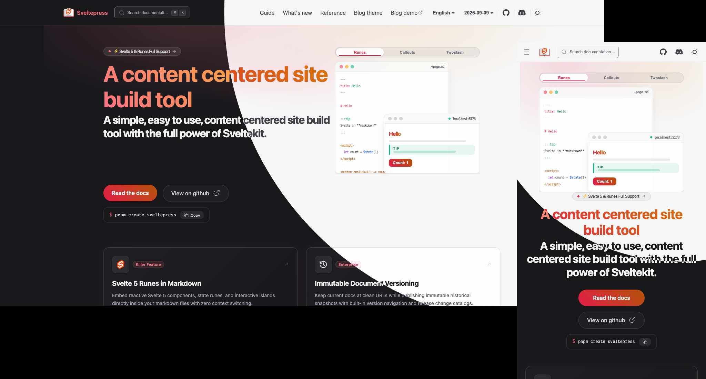
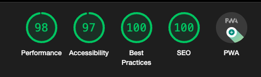

<h1 align="center">
  <br>
 
  <br>
  Sveltepress
  <br>
  <br>
</h1>

<p align="center">
A content centered site build tool
</p>

<p align="center">
  <a href="https://sveltepress.site/" target="_blank" rel="noopener noreferrer" >
    
  </a>
</p>

<p align="center">
  <a href="https://sveltepress.site/" target="_blank" rel="noopener noreferrer" >
    
  </a>
</p>

## :pizza: Introduction

Inspired by [Vitepress](https://vitepress.vuejs.org/)
Build with [SvelteKit](https://kit.svelte.dev/)

Sveltepress supports Svelte 5, SvelteKit 2, and Vite 8. Use Node.js `^20.19.0` or `>=22.12.0`.

## :rocket: Quick start

```bash
npm create @sveltepress@latest
```

The generated project uses the default documentation theme. For an editorial site with posts, pagination, RSS, Open Graph images, and Pagefind search, follow the [blog theme guide](https://sveltepress.site/guide/blog-theme/getting-started/).

## :package: Packages

| Package | Purpose |
|---|---|
| [`@sveltepress/create`](./packages/create/) | Interactive scaffolder for JavaScript and TypeScript Sveltepress sites |
| [`@sveltepress/cli`](./packages/cli/) | Version manifest, documentation snapshot, and validation CLI |
| [`@sveltepress/vite`](./packages/vite/) | Core Vite and SvelteKit integration, Markdown pipeline, and version routing |
| [`@sveltepress/theme-default`](./packages/theme-default/) | Default documentation theme with navigation, search, and content features |
| [`@sveltepress/theme-blog`](./packages/theme-blog/) | Static magazine-style blog theme with posts, pagination, RSS, OG images, and Pagefind |
| [`@sveltepress/twoslash`](./packages/twoslash/) | TypeScript and Svelte hover information for Shiki code blocks |
| [`@sveltepress/docsearch`](./packages/docsearch/) | Algolia DocSearch UI component for Sveltepress themes |
| [`@sveltepress/meilisearch`](./packages/meilisearch/) | Meilisearch search UI integration for Sveltepress themes |

## :bookmark_tabs: Online docs and demos

[Sveltepress](https://sveltepress.site/)

## :pray: Contributing

First of all, all kinds of contributions are welcomed!

For contributing details, see [Contributing](./CONTRIBUTING.md)

## :heart: Thanks

This project can not be done without these projects

* [Vitepress](https://vitepress.vuejs.org/)
* [SvelteKit](https://kit.svelte.dev/)
* [Svelte](https://svelte.dev/)
* [Vitest](https://vitest.dev/)
* [Vite](https://vitejs.dev/)
* [Unocss](https://github.com/unocss/unocss)
* [Shiki](https://github.com/shikijs/shiki)
* [Remark](https://github.com/remarkjs/remark)
* [Rehype](https://github.com/rehypejs/rehype)
* [Vite PWA](https://github.com/vite-pwa/docs)

## Who's using

[](https://github.com/kryptokrona/kryptokrona-kotlin-sdk)
[](https://svelte.casual-ui.site/)
[](https://svelte-u.vercel.app/)
[](https://writewithharper.com/)
[](https://svelte-router.dev)

## LICENSE

[MIT](./LICENSE)
