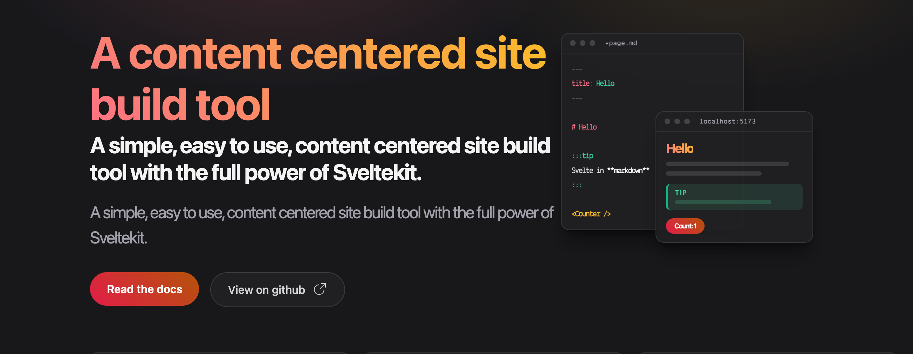
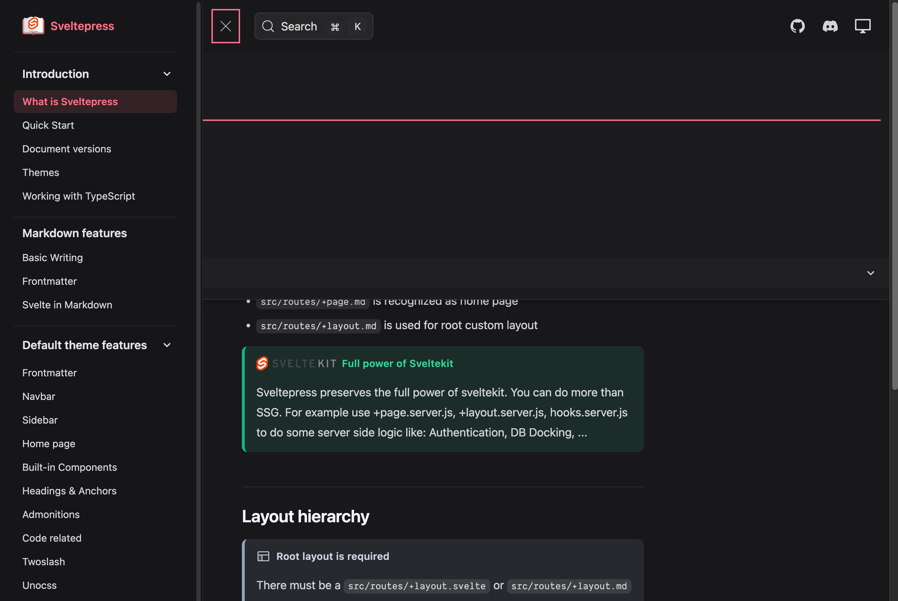
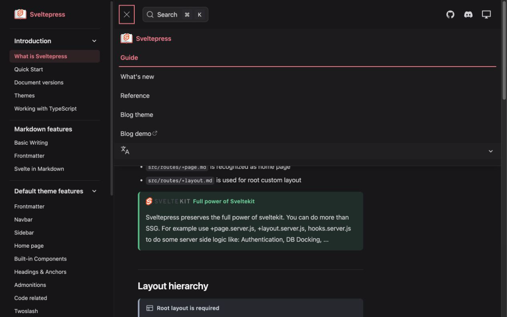

# Home and collapsed-navbar regression fixes

Two user-visible regressions were reproduced against the current English documentation site at `127.0.0.1:4182`.

- The home hero rendered the same description twice through `description` and `tagline`. The browser loop counted two exact matches before the fix and one after it.
- At a 1280px viewport, the expanded top-navigation labels started at 55.23px while the persistent documentation sidebar ended at 288px. The labels were therefore painted behind the sidebar. After the fix, the first label starts at 343.23px and remains fully visible beside the sidebar.

## Home hero before and after

## Intermediate-width navigation before and after

The original browser loop was run twice before and after the fix. Both checks failed deterministically before the change and passed twice after rebuilding the Default Theme package. No historical documentation snapshot was modified.
