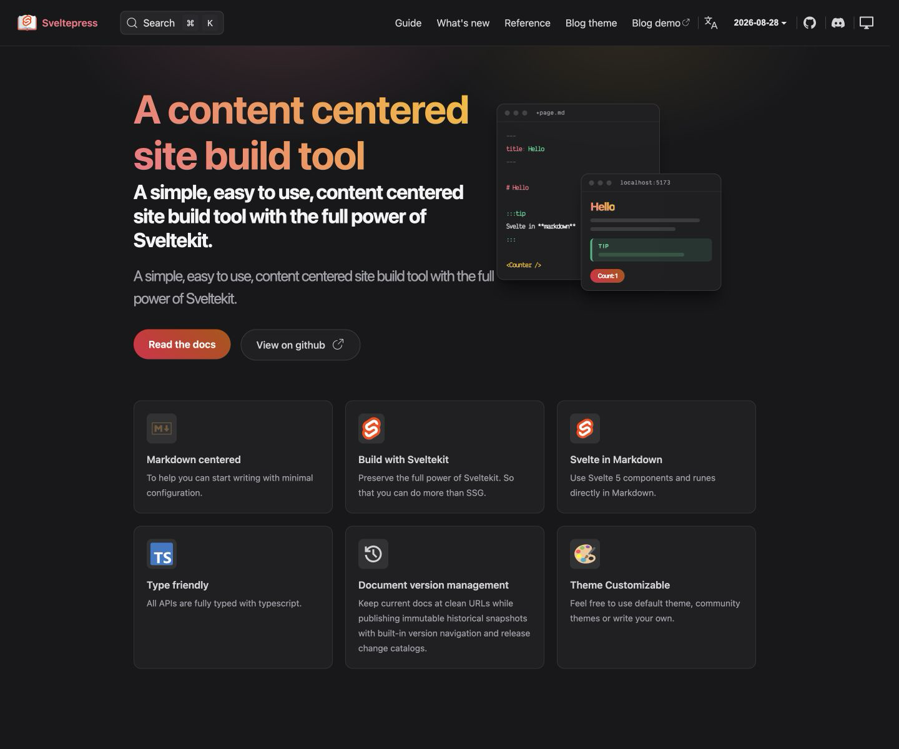
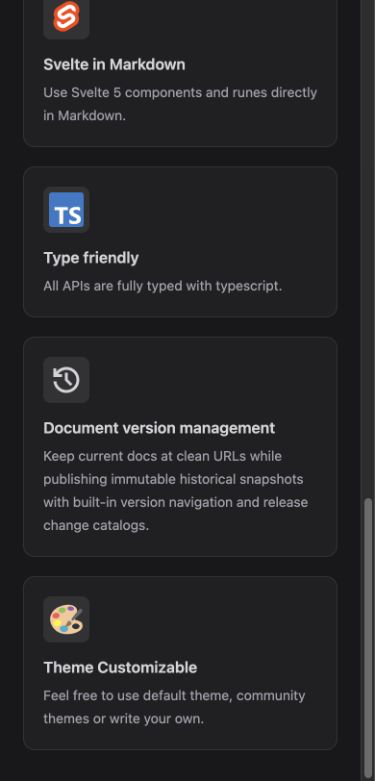

# Version management home-page feature

The current English, Chinese, and Bengali home pages now present document version management as a first-class feature and link directly to the localized `/guide/version-management/` route.

At a 1440px viewport, all six feature cards form two aligned rows of three. The version-management card renders the prebuilt `material-symbols:history` icon and occupies the center of the second row.

At a 390px viewport, all six cards use one column. The screenshot is centered on the complete version-management card and its two neighbours; the card measures 327px wide with a 36px `material-symbols:history` icon, and the page has zero horizontal overflow.

Activating the English card navigated to `/guide/version-management/`. A fresh browser tab reported no console errors or warnings.
