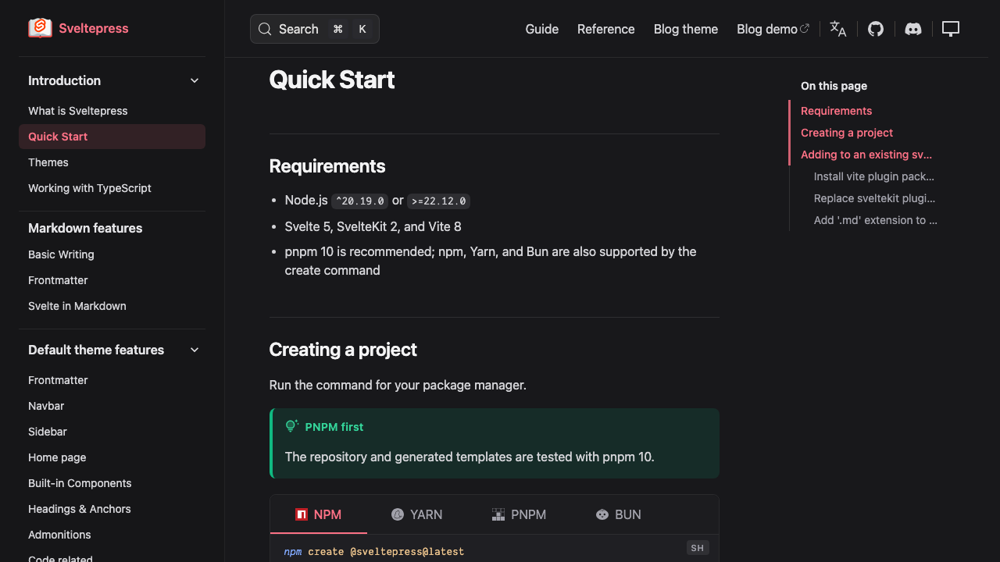
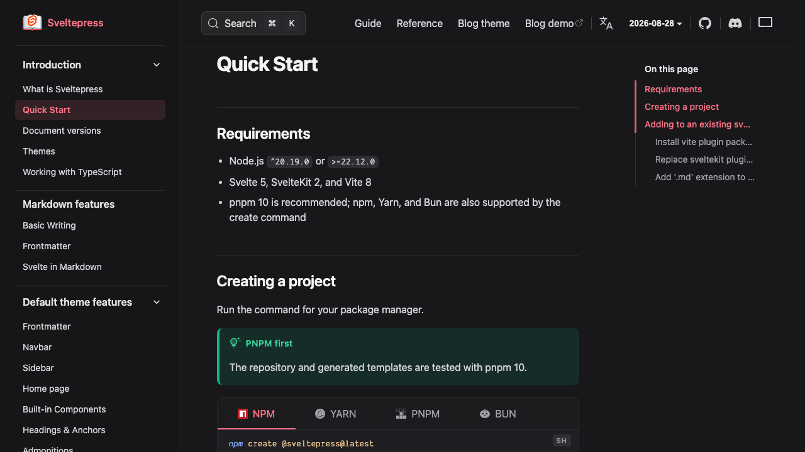
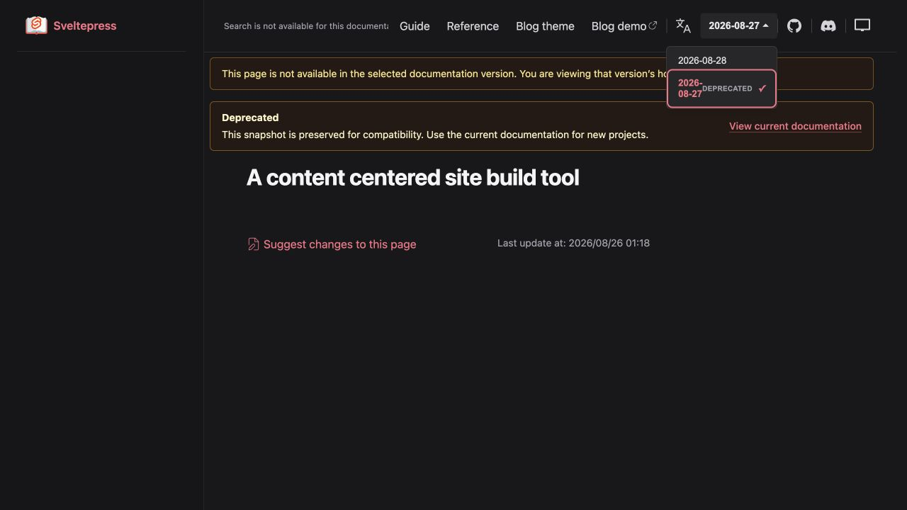
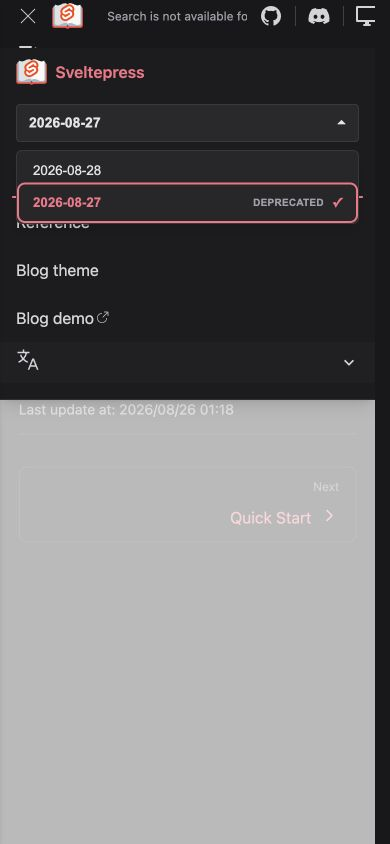

# Document version management release evidence

The official English documentation site was used as the real acceptance fixture. It serves `2026-08-28` at the normal routes and the CLI-created `2026-08-27` snapshot below `/v/2026-08-27/`.

## Before and after

Both images show the official Quick Start page at 1280 × 720. The before image was built from the fixed pre-feature baseline commit `a7993b9a`; the after image was built from the release candidate. The after Navbar adds the current documentation version selector while preserving the page, search, navigation, sidebar, and table-of-contents layout.

### Before

### After

## Desktop

The historical fallback page shows the selected version, deprecated lifecycle state, current-version recovery link, search isolation, and missing-page explanation.

## Mobile

The mobile navigation drawer exposes the same version selector and lifecycle label.

The no-manifest compatibility path was exercised by production builds and Svelte checks for the Chinese and Bengali documentation sites; neither site renders version UI without a manifest.
