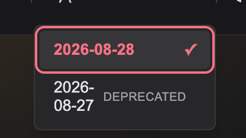
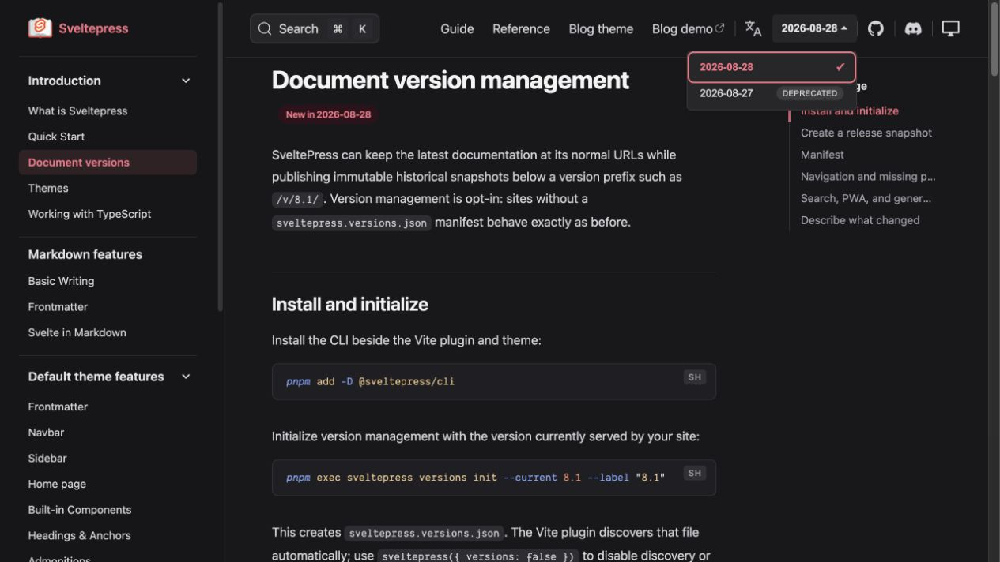

# Version selector lifecycle badge

## Before

The date-based historical version wrapped because the lifecycle text competed for the selector's narrow width.

## After

The selector reserves enough width for a complete date label, prevents the label from shrinking, and presents the lifecycle state as a compact badge.

Verified on the English documentation site in dark mode at the desktop breakpoint. A fresh page load produced no browser console errors or warnings.
