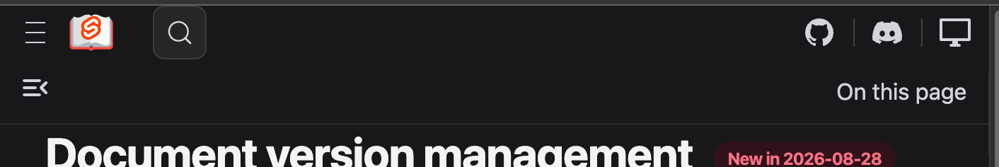
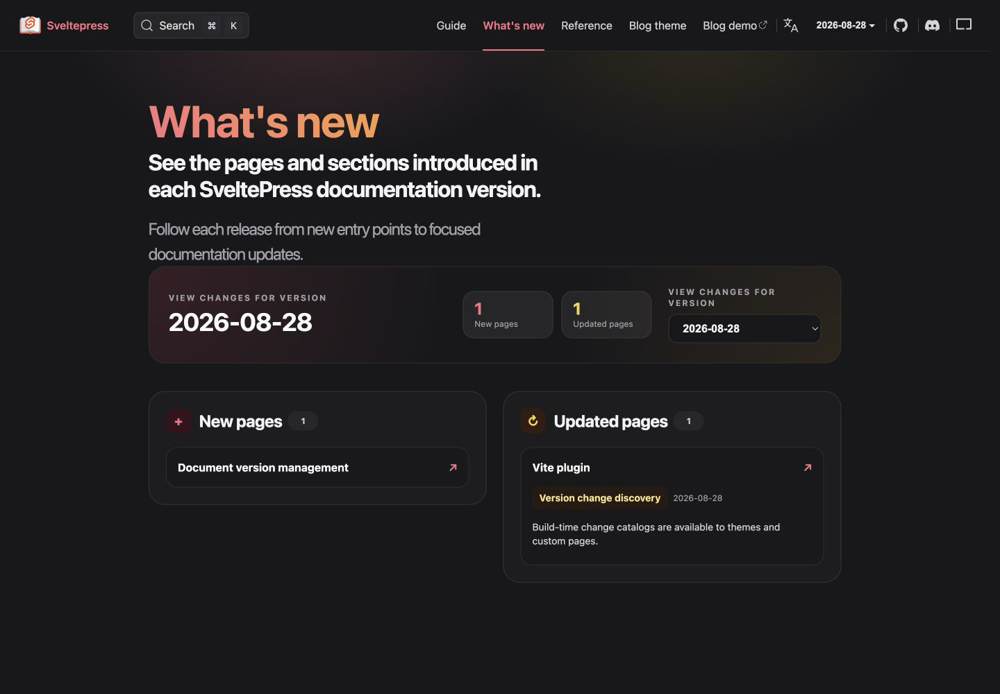
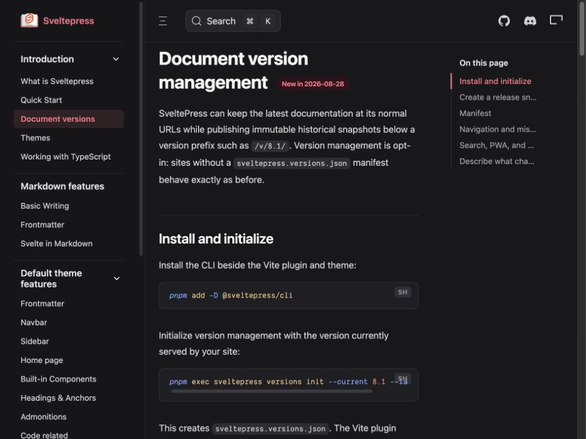
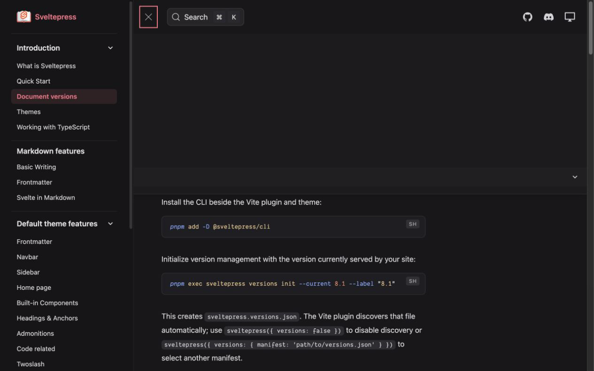
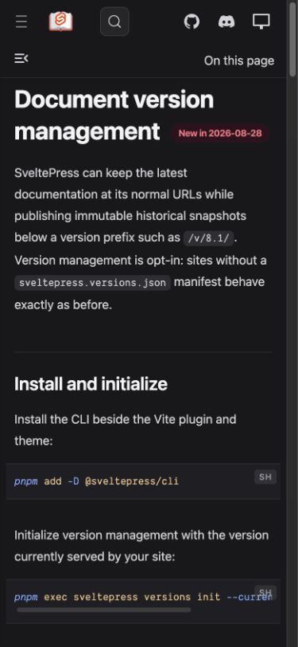

# What's New and responsive navigation

## Reported state

At a narrow desktop width, the complete text navigation competed with search, version controls, and social links until labels overlapped.

The mobile header also had uneven spacing, while documentation controls were shown on a page that did not need them.

## Verified state

The English What's New route now uses the reusable home layout, keeps its own title and description, omits the documentation sidebar and previous/next switcher, and presents version changes as a responsive release dashboard.

At 1024px, the full text navigation is replaced by the compact menu. On documentation pages the menu and search begin after the fixed sidebar, so none of the controls overlap.

The compact layout remains active at the 1280px boundary. Its labelled disclosure opens below the 73px desktop header rather than covering it, while the document keeps zero horizontal overflow.

At 390px, the primary header is 56px tall, controls have even spacing, separators are removed, and the documentation sub-navigation occupies its own 45px row only when relevant.

All tested viewports had zero horizontal document overflow and no browser console errors or warnings. The default mobile home page also keeps a single 56px header offset when no documentation sub-navigation exists.
